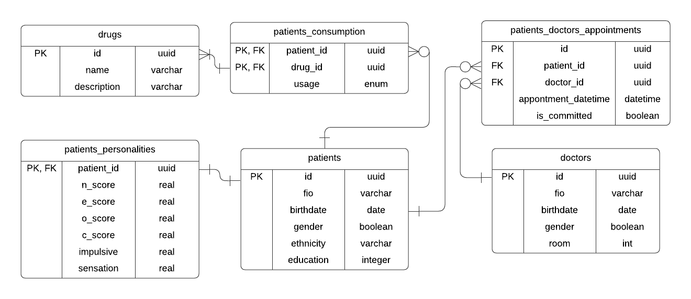

# Лабораторная 1

Было принято решение создать БД на
основе [набора данных](https://www.kaggle.com/datasets/mexwell/drug-consumption-classification) с сайта Kaggle.
Набор данных содержит информацию о зависимостях людей и результатах психологических тестов.

На основе набора данных была придумана модель частной наркологической клиники.

# Схема данных

Всего присутствует 4 сущности:

- врачи больницы
- пациенты
- перечень веществ, от которых зависимы пациенты
- записи пациентов на приемы к врачам

На основе них сформированы 6 таблиц:

- doctors - врачи, содержащую информацию о враче
- patients - пациенты, содержащую базовую информацию о пациенте
- drugs - вещества
- patients_personalities - информация о результате психологических тестов. Связана сс таблицей пациентов 1 : 1.
- patients_consumption - таблица реализующая связь 1 : N между пациентами и последним употреблением веществ, обогащенная
  информацией о последнем употреблении.
- patients_doctors_appointments - таблица, реализующая связь N : M пациентов и врачей, обогащенная датой посещения и
  флагом, показывающим, состоялся ли прием.



Скрипт создания схемы БД и таблиц - init.sql

# Заполнение данных

Для большей реалистичности данных данные из набора данных были преобразованы в человеко-читаемые с помощью написанного
скрипта transform.py.
Далее был сформирован набор скриптов fill.ipynb для заполнения таблиц данными.

- doctors - строки со случайным именем, датой рождения (такой, чтобы врач был возрастом от 28 до 60 лет), из расчета ~ 1
  врач на 50 пациентов
- drugs - перечень, который используется в наборе данных
- patients - строки из используемого набора данных со случайным именем и датой рождения (которая основана на возрасте из
  набора данных)
- patients_personalities - строки из используемого набора данных
- patients_consumption - одна строка набора данных разбивалась на несколько строк - одна строка на каждое наркотическое
  вещество, при чем вещества с последнем употреблением = CL0 (никогда) игнорировались
- patients_doctors_appointments - случайные данные из расчета, что клиника работает уже 7 лет с понедельника по субботу,
  ежедневно у каждого врача может быть до 20 пациентов, всего ежедневно в клинике находятся от 5 до 20 врачей. При чем
  на консультации,которые уже состоялись (то есть были позже чем сегодня), пациент приходил с вероятностью в ~70%.

После выполнения скрипта в БД оказывалось около 450 тысяч строк суммарно (хоть и случайное число, но зависящее от кол-ва
пациентов, то есть строк в наборе данных).
Для большей нагрузки на БД скрипт был запущен 5 раз, чтобы искусственно увеличить кол-во врачей, пациентов и их данных,
а также записей на примем.

# Запросы

Были придуманы 5 типовых запросов в БД.

### Запрос 1

Получение всех записей на прием к определенному доктору на ближайшую неделю, обогащенные информацией о пациентах,
которые должны прийти на прием.

```sql
select app.appointment_datetime,
       p.fio                                        as patient,
       p.gender,
       extract('year' from age(now(), p.birthdate)) as age
from clinic.patients_doctors_appointments app
inner join clinic.doctors d
    on d.id = app.doctor_id
inner join clinic.patients p
    on app.patient_id = p.id
where 
    d.id = :doctorId
    and appointment_datetime > now()
    and appointment_datetime < now() + interval '7 day'
order by appointment_datetime;
```

Получение личной карточки пациента, содержащей базовую и психологическую информацию о пациенте, а также
вещество, от которого больше всего зависит пациент, с последнем временем его использования.

### Запрос 2

```sql
select p.fio,
       p.gender,
       extract('year' from age(now(), p.birthdate)) as age,
       p.education,
       p.ethnicity,
       d.name                                       as main_addiction,
       c.usage                                      as last_usage,
       pp.impulsive,
       pp.sensation,
       pp.c_score,
       pp.e_score,
       pp.n_score,
       pp.o_score
from clinic.patients p
inner join clinic.patients_personalities pp
    on p.id = pp.patient_id
inner join clinic.patients_consumption c
          on p.id = c.patient_id
              and c.drug_id in (select distinct on(patient_id)
                                      drug_id
                                from clinic.patients_consumption
                                where patient_id = p.id
                                order by patient_id, usage desc)
inner join clinic.drugs d
    on c.drug_id = d.id
where 
    extract('year' from age(now(), p.birthdate)) > :age_min
    and extract('year' from age(now(), p.birthdate)) < :age_max
order by p.id, c.usage desc;
```

### Запрос 3

Получение количества консультаций у всех врачей за текущий месяц (для расчета ЗП 😀)

```sql
select d.fio,
       count(*) as appointments
from clinic.patients_doctors_appointments app
inner join clinic.doctors d
    on d.id = app.doctor_id
where 
    appointment_datetime > date_trunc('month', now())::date
    and appointment_datetime < date_trunc('month', now())::date + interval '1 month'
group by d.id
order by appointments desc;
```

### Запрос 4

Получение общего процента пропуска приемов у каждого пациента

```sql
select p.fio,
       trunc((100 * missed_app.missed_count::float / all_app.all_count):: numeric, 2) as missed_percent
from clinic.patients as p
left join (select patient_id, count(*) as missed_count
           from clinic.patients_doctors_appointments
           where 
                not is_committed
                and appointment_datetime < now()
           group by patient_id) as missed_app
                on p.id = missed_app.patient_id
left join (select patient_id, count(*) as all_count
           from clinic.patients_doctors_appointments
           where 
                appointment_datetime < now()
           group by patient_id) as all_app
                on p.id = all_app.patient_id;
```

### Запрос 5

Получение пациентов, чье последнее потребление любого веществ меньше какого-либо (для получение идущих на поправку или
рецидивистов)

```sql
select p.fio
from clinic.patients p
inner join clinic.patients_personalities pp
    on p.id = pp.patient_id
inner join clinic.patients_consumption c
    on p.id = c.patient_id
group by p.id
having max(c.usage) <= :lastUsage
```

# Оптимизация

### Запросы

Для начала было решено оптимизировать запросы к БД.

Первым был запрос получение личных карточек пациентов определенного возраста (запрос 2) который занимал ~156 ms.
Для того чтобы выбрать главную зависимость пациента использован подзапрос,
который в т.ч обеспечивает уникальность каждой строки результата по patient_id.
Запрос был переписан так, что уникальность и выбор главной зависимости происходил на уровне всего запроса с помощью
distinct и order by:

```sql
select distinct
on (p.id) p.fio,
    p.gender,
    extract ('year' from age(now(), p.birthdate)) as age,
    p.education,
    p.ethnicity,
    d.name as main_addiction,
    c.usage as last_usage,
    pp.impulsive,
    pp.sensation,
    pp.c_score,
    pp.e_score,
    pp.n_score,
    pp.o_score
from clinic.patients p
inner join clinic.patients_personalities pp
    on p.id = pp.patient_id
inner join clinic.patients_consumption c
    on p.id = c.patient_id
inner join clinic.drugs d
    on c.drug_id = d.id
where 
    extract ('year' from age(now(), p.birthdate)) > :age_min 
    and extract ('year' from age(now(), p.birthdate)) < :age_max
order by p.id, c.usage desc;
```

это позволило ускорить запрос в 3 раза - время выполнения стало ~ 49 ms.

Также запрос для получения количества пропусков приемов пациентов (запрос 4) мог быть ускорен путем вынесения общей
части
при получении всех записей до текущей даты.
Общая часть была вынесена при помощи конструкции with:

```sql
with all_appointments as (select patient_id, is_committed
                          from clinic.patients_doctors_appointments
                          where appointment_datetime < now())
select p.fio,
       trunc((100 * missed_app.missed_count::float / all_app.all_count):: numeric, 2) as missed_percent
from clinic.patients as p
left join (select patient_id, count(*) as missed_count
           from all_appointments
           where 
              not is_committed
           group by patient_id) as missed_app
    on p.id = missed_app.patient_id
left join (select patient_id, count(*) as all_count
           from all_appointments
           group by patient_id) as all_app
    on p.id = all_app.patient_id;
```

Однако вместо ускорения было получено замедление - с ~500 ms до ~690 ms.

### Индексы

Единственная таблица, чей индекс был смысл пробовать менять - patients_doctors_appointments.
Было решено удалить предыдущий индекс и добавить новый -

```sql
create index appointments_date_doctor_id_index
    on clinic.patients_doctors_appointments (doctor_id, appointment_datetime);
```

Который ускорил запросы получения всех записей определенного доктора на неделю вперед (запрос 1)
и кол-во приемов у всех докторов за месяц (запрос 3) с 130ms и 366ms на 3ms и 10ms соответственно.
Время выполнения остальных запросов не изменилось.
Также для ускорения получения процента пропусков приемов у всех пациентов (запрос 4)
предыдущий индекс был заменен на

 ```sql
create index appointments_date_index
    on clinic.patients_doctors_appointments (appointment_datetime);
```

Однако время выполнения не изменилось как для запросов 1 и 3 (ожидалось небольшое замедление),
так и для 4 (ожидалось ускорение) - не поменялось.

### Настройки БД

Была изменение единственная настройка - random_page_cost (из-за большой популярности в интернете при оптимизации),
которая заставляет систему, при приближении этого значения к seq_page_cost = 1, предпочитать сканирование по индексу,
что может увеличить производительность.
При изменении этой настройки к указываемому везде значению random_page_cost = 1 время изначальных запросов увеличилось
следующим образом (без предыдущих оптимизаций):

| запрос | было, ms | стало, ms     |
|--------|----------|---------------|
| 1      | 134      | 115           |
| 2      | 156      | 106           |
| 3      | 366      | не поменялось |
| 4      | 512      | 480           |
| 5      | 33       | 25            |

### Итог

В итоге, после всех удачных оптимизаций, время запросов стало следующим

| запрос | было, ms | стало, ms |
|--------|----------|-----------|
| 1      | 134      | 3         |
| 2      | 156      | 49        |
| 3      | 366      | 10        |
| 4      | 512      | 480       |
| 5      | 33       | 25        |


# Лабораторная 2
В качестве данных для обучения модели машинного обучения были выбраны данные из БД первой ЛР. Модель, которая будет построена 
должна оценивать вероятность употребления какого-либо вида наркотических веществ на основе данных о пациенте.

### Данные
Для оценки вероятности употребления человеком какого-либо вещества было выбрано "LSD", поскольку примерно половина пациентов
из БД хотя бы раз употребляли его, а половина - нет (что позволит не балансировать набор данных).
(Для понимания какая доля пациентов когда-либо употребляли какое-либо вещество был использован запрос:
```sql
select name, count(*) from clinic.patients_consumption
inner join clinic.drugs
    on drug_id = drugs.id
group by name
```
).
Для получения всех данных о пациенте, а также факта того, 
употреблял ли человек выбранное вещество хоть раз был построен следующий запрос:

```sql
select p.gender,
       extract('year' from age(now(), p.birthdate)) as age,
       p.education,
       p.ethnicity,
       pp.impulsive,
       pp.sensation,
       pp.c_score,
       pp.e_score,
       pp.n_score,
       pp.o_score,
       c is not null                                as was_addicted
from clinic.patients p
inner join clinic.patients_personalities pp
    on p.id = pp.patient_id
left join clinic.patients_consumption c
    on c.patient_id = p.id
    and c.drug_id in (select id
                      from clinic.drugs
                      where name = 'LSD')
```

Результат выполнения запроса экспортирован в dataset.csv.

Далее было необходимо загрузить
```python
dataset = pd.read_csv('dataset.csv', delimiter=';')
```
и обработать данные:
1. Закодировать этнос, представленный строкой и пол, представленный булевым значением
```python
dataset['ethnicity'] = dataset['ethnicity'].astype('category').cat.codes.to_numpy()
dataset['gender'] = dataset['gender'] * 2 - 1
```
2. Разбить данные на входные и целевые значения, а также привести целевое значение в виде вероятностей
```python
x = dataset.drop(columns=['was_addicted'], inplace=False).to_numpy()
y = dataset['was_addicted'].to_numpy() * 1
```
3. Разделить выборку на обучающую и тестовую
```python
train_x, test_x, train_y, test_y = sklearn.model_selection.train_test_split(x, y, test_size=0.33, random_state=123)
```
4. Нормализовать входные значения
```python
scaler = preprocessing.StandardScaler().fit(train_x)
preprocessed_train_x = scaler.transform(train_x)
preprocessed_test_x = scaler.transform(test_x)
```
После всех манипуляций набор данных готов к использованию в обучении модели машинного обучения.

### Обучение

В качестве модели машинного обучения выбран многослойный персептрон.

Создаем модель с полносвязными слоями и слоями регуляризации Dropout.

```python
model.add(layers.Dropout(0.25))
model.add(layers.Dense(16, activation='swish'))
model.add(layers.Dropout(0.25))
model.add(layers.Dense(32, activation='swish'))
model.add(layers.Dropout(0.25))
model.add(layers.Dense(16, activation='swish'))
model.add(layers.Dense(1, activation='sigmoid'))
model.compile(loss=keras.losses.BinaryCrossentropy(from_logits=False), optimizer=keras.optimizers.Nadam(learning_rate=0.01), metrics=[keras.metrics.AUC()])
```
В качестве функции активации на скрытых слоях выбрана функция swish (SiLU, сигмоидально-линейная функция) из-за своей эффективности (также использовались ReLU и Leaky ReLU, но результат у модели, использовавших их, был примерно на десятую долю хуже).
В качестве функции активации на последнем слое и функции ошибки были выбраны типичные для бинарной классификации - sigmoid и binary crossentropy.
В качестве оптимизатора выбран Nadam (Adam с моментом Нестерова вместо обычного момента), поскольку показал себя лучше остальных в скорости обучения (рассматривались также Adam и СГС с моментом).
Модель обучалась на протяжении 15 эпох.

После обучения получим предсказания на тестовой выборке, подсчитаем лучшее пороговое значение с помощью ROC кривой:


Далее, используя лучшее пороговое значение, посчитаем метрики:
```
accuracy: 0.7287319422150883, 
precision: 0.6730769230769231, 
recall = 0.7581227436823105, 
roc auc = 0.7878800525865487
confusion matrix:
 [[244 102]
 [ 67 210]]
```

Полный код представлен в learn.ipynb
